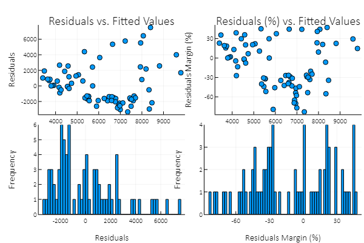

# diagnoserjl
***Robert Schnitman***  
***2018-03-16***  
***Recommended Citation:  
    &nbsp;&nbsp;&nbsp;&nbsp;&nbsp;&nbsp; Schnitman, Robert (2018). diagnoserjl v0.0.1.0. https://github.com/robertschnitman/diagnoserjl***

# Outline
0. Installation (*under construction*)
1. Introduction
2. diagnose()
3. fitres()
4. modeldf()
5. validate()
6. Conclusion
7. References

## 0. Installation

```julia
# Julia ≥ 0.6.2.
# Package imports
#   DataFrames ≥ 0.10.1
#   GLM        ≥ 0.8.1
#   Plots      ≥ 0.15.1
  
Pkg.clone("https://github.com/robertschnitman/diagnoserjl.git")
```

## 1. Introduction
Based on the original R library, `diagnoser` (https://github.com/robertschnitman/diagnoser).

Motivation: make an equivalent package for Julia for pedagogical purposes and to take advantage of its capabilities.

Tables in the sections below were created with a Markdown table converter (Donat Studios 2017).

## 2. diagnose()
```julia
file = "stata_auto.csv"
auto = readtable(file)

model_lm = fit(LinearModel, @formula(price ~ mpg + weight), auto)

diagnose(model_lm)
```


## 3. modeldf()

```julia
modeldf(model_lm, 0.95) # default confidence interval is 0.95.
```
|     |             |          |          |         |          |          |           |        | 
|-----|-------------|----------|----------|---------|----------|----------|-----------|--------| 
| Row | terms       | beta     | se       | moe     | ci_lower | ci_upper | t         | p      | 
| 1   | (Intercept) | 1946.07  | 3597.05  | 7172.31 | -5226.24 | 9118.38  | 0.541018  | 0.5902 | 
| 2   | mpg         | -49.5122 | 86.156   | 171.79  | -221.302 | 122.278  | -0.574681 | 0.5673 | 
| 3   | weight      | 1.74656  | 0.641354 | 1.27882 | 0.467736 | 3.02538  | 2.72324   | 0.0081 | 

## 4. fitres()

```julia
fitres(model_lm) # Outputs a dataframe: fitted values, residuals, and residuals %.
```
|     |         |           |                  | 
|-----|---------|-----------|------------------| 
| Row |  fit    |  residual |  residual_pct    | 
| 1   | 5974.22 | -1875.22  | -0.457482        | 
| 2   | 6955.33 | -2206.33  | -0.464589        | 
| 3   | 5467.72 | -1668.72  | -0.439251        | 
| 4   | 6632.14 | -1816.14  | -0.377106        | 
| 5   | 8329.35 | -502.347  | -0.0641813       | 
| 6   | 7464.72 | -1676.72  | -0.289689        | 
| 7   | 4553.58 | -100.578  | -0.0225865       | 
| 8   | 6684.54 | -1495.54  | -0.288213        | 
| 9   | 7930.52 | 2441.48   | 0.235391         | 
| 10  | 6943.64 | -2861.64  | -0.701038        | 
| 11  | 8815.5  | 2569.5    | 0.225692         | 
| …   |         |           |                  | 
| 63  | 3918.89 | 76.1108   | 0.0190515        | 
| 64  | 7226.13 | 5763.87   | 0.443716         | 
| 65  | 3854.95 | 40.0458   | 0.0102813        | 
| 66  | 3793.59 | 4.41278   | 0.00116187       | 
| 67  | 5264.06 | 634.944   | 0.107636         | 
| 68  | 4253.62 | -505.62   | -0.134904        | 
| 69  | 5718.16 | 0.838351  | 0.000146591      | 
| 70  | 4579.86 | 2560.14   | 0.358564         | 
| 71  | 3479.05 | 1917.95   | 0.355374         | 
| 72  | 4079.12 | 617.878   | 0.131547         | 
| 73  | 4183.92 | 2666.08   | 0.389209         | 
| 74  | 6640.95 | 5354.05   | 0.446357         | 

```julia
fr = fitres(model_lm, auto) # If the original dataset from the model is specified,
                            #   then the fitted values & residuals are merged with it.
                            
fr[1:10, [:price, :mpg, :weight, :fit, :residual, :residual_pct]]

```
| Row |  price |  mpg |  weight |  fit    |  residual  | residual_pct    | 
|-----|--------|------|---------|---------|------------|-----------------| 
| 1   | 4099   | 22   | 2930    | 5974.22 | -1875.22   | -0.457482       | 
| 2   | 4749   | 17   | 3350    | 6955.33 | -2206.33   | -0.464589       | 
| 3   | 3799   | 22   | 2640    | 5467.72 | -1668.72   | -0.439251       | 
| 4   | 4816   | 20   | 3250    | 6632.14 | -1816.14   | -0.377106       | 
| 5   | 7827   | 15   | 4080    | 8329.35 | -502.347   | -0.0641813      | 
| 6   | 5788   | 18   | 3670    | 7464.72 | -1676.72   | -0.289689       | 
| 7   | 4453   | 26   | 2230    | 4553.58 | -100.578   | -0.0225865      | 
| 8   | 5189   | 20   | 3280    | 6684.54 | -1495.54   | -0.288213       | 
| 9   | 10372  | 16   | 3880    | 7930.52 | 2441.48    | 0.235391        | 
| 10  | 4082   | 19   | 3400    | 6943.64 | -2861.64   | -0.701038       | 


## 5. validate()

### Case 1: OLS

```julia
validate(model_lm, false) # By default, the output (dataframe = false) returns an array. 
                          # Set to "true" for a dataframe.
                          # See help documentation (?validate) for statistics definitions.
```

|                   |             | 
|-------------------|-------------| 
| :n                | [74.0]      | 
|  :ar2             | [0.273485]  | 
|  :r2              | [0.293389]  | 
|  :rmse            | [2462.54]   | 
|  :mad             | [1389.76]   | 
|  :mae             | [1966.89]   | 
|  :medianpe        | [-0.105916] | 
|  :mpe             | [-0.11274]  | 
|  :sdpe            | [0.358649]  | 
|  :sepe            | [0.041692]  | 
|  :residual_mean   | [-0.0]      | 
|  :residual_median | [-503.983]  | 
|  :residual_sd     | [2479.35]   | 
|  :residual_se     | [288.219]   | 


### Case 2: GLM (logit)

```julia
testf = function(x)      # Setting up a binary variable for a logistic regression.
    if (x == "Domestic")
		0
    else
		1
    end
end

auto[:foreign2] = testf.(auto[:foreign])
model_glm = fit(GeneralizedLinearModel, @formula(foreign2 ~ mpg + weight), auto, Binomial())

validate(model_glm, true) # dataframe = true --> outputs dataframe
```

|     |                    |             | 
|-----|--------------------|-------------| 
| Row |  statistic         |  value      | 
| 1   |  n                 |  [74.0]     | 
| 2   |  deviance_residual |  [54.3503]  | 
| 3   |  aer               |  [0.013514] | 


## 6. Conclusion

The hope of this library is to (1) minimize the programming tedium in statistical reporting; (2) assist people in diagnosing the validity of their results; and (3) inspire developers and end-users alike to apply Julia in their work.

## 7. References

Schnitman, Robert (2017). diagnoser v0.0.2.5. https://github.com/robertschnitman/diagnoser

Donat Studios (2017). *CSV To Markdown Table Generator*. https://donatstudios.com/CsvToMarkdownTable

*End of Document*
